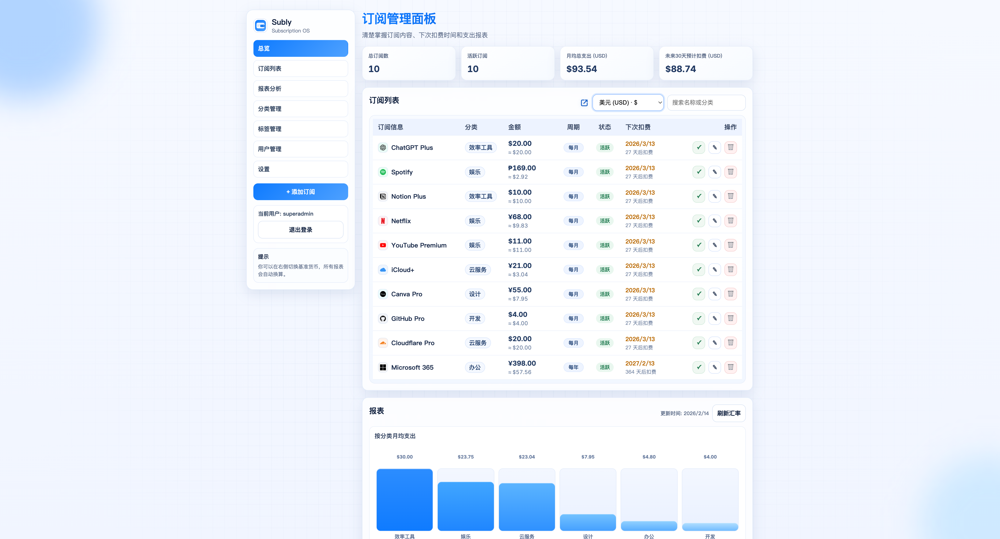

# Subly 订阅管理软件

这是一个本地可运行的订阅管理工具，支持：

- 订阅新增 / 编辑 / 删除
- 用户认证（注册 / 登录 / 退出，会话令牌）
- 支持在设置页从国际币种目录中选择并添加币种（自动拉取该币种汇率）
- 报表汇率实时转换（后端拉取实时汇率，失败时自动回退缓存）
- 下次扣费时间追踪（支持“已扣费”自动顺延）
- 汇总卡片（总订阅、活跃订阅、月均支出、未来 30 天预计扣费）
- 报表展示（按分类月均支出、未来 6 个月预计支出）

## 界面预览




## 启动方式

在项目目录执行：

```bash
python3 /path/to/2Subly/server.py
```

访问：

- [http://localhost:5173](http://localhost:5173)

## Docker 部署

### 1) 使用 Docker Compose（推荐）

在项目目录执行：

```bash
docker compose up -d --build
```

访问：

- [http://localhost:5173](http://localhost:5173)

停止：

```bash
docker compose down
```

数据持久化目录：

- `${SUBLY_DATA_DIR:-/opt/subly/data}/subly.db`（映射到容器 `/app/data/subly.db`）

建议先创建并授权目录（尤其是 Portainer）：

```bash
mkdir -p /opt/subly/data
chown -R 10001:10001 /opt/subly/data
chmod -R u+rwX,g+rwX /opt/subly/data
```

如果你不想使用默认目录，可通过环境变量指定：

```bash
export SUBLY_DATA_DIR=/your/absolute/path/subly-data
docker compose up -d --build
```

### Portainer 重新部署注意事项

- 不要使用相对路径（如 `./data`），请使用绝对宿主机路径。
- 确保每次重部署都挂载同一个 `SUBLY_DATA_DIR`。
- 只要挂载目录不变，`subly.db` 就会持续保留。

### 2) 使用 Docker CLI

构建镜像：

```bash
docker build -t subly:latest .
```

运行容器：

```bash
docker run -d \
  --name subly \
  -p 5173:5173 \
  -e HOST=0.0.0.0 \
  -e PORT=5173 \
  -e DB_PATH=/app/data/subly.db \
  -e SUPER_ADMIN_USERNAME=superadmin \
  -e SUPER_ADMIN_PASSWORD=Subly@123456 \
  -v "/opt/subly/data:/app/data" \
  subly:latest
```

## 环境变量

- `HOST`：监听地址（Docker 建议 `0.0.0.0`）
- `PORT`：监听端口（默认 `5173`）
- `DB_PATH`：SQLite 文件路径（默认 `subly.db`）
- `SUPER_ADMIN_USERNAME`：超级管理员用户名
- `SUPER_ADMIN_PASSWORD`：超级管理员密码（生产环境务必修改）
